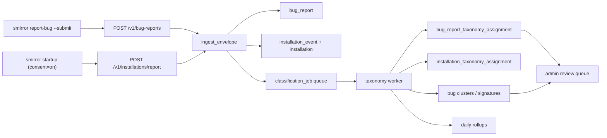

# Telemetry Microserver Architecture

## Goal

Define the server-side architecture for SelectiveMirror's Postgres-backed microserver that collects user-approved bug reports and minimal opt-in installation events, then assigns taxonomy labels asynchronously.

Scope and consent model:

- **Bug reports**: per-event approval. The user runs `smirror report-bug` and explicitly approves each submission. There is no global "send bug reports automatically" setting.
- **Installation telemetry**: opt-in via the MSI installer checkbox at install time (default unchecked) or via the runtime command `smirror telemetry on`. If enabled, smirror sends two event types only — `first_seen` (one per install, at first run) and `upgrade` (on each version change). NO heartbeat. NO continuous phoning home. The user can revoke at any time via `smirror telemetry off`.
- **Crashes**: never auto-submitted. Recorded only to local disk. May be embedded in a user-approved bug report via `report-bug --include-crashes`.

The key constraint on the request path is that taxonomy assignment must be non-blocking. Ingest must succeed or fail quickly without waiting for classification.

## Client-side flow: telemetry primary, GitHub additive

The telemetry endpoint is the **primary** structured channel for bug reports: every approved `smirror report-bug --submit` produces one row in `telemetry.bug_report` with full structured fields, queryable signature, and asynchronous classification.

GitHub Issues are an **additive** public-discussion overlay. When the user passes `--browser`, smirror submits to telemetry first and then opens a prefilled GitHub issue in the user's browser. The GitHub issue is for community discussion (back-and-forth, search, "is anyone else hitting this?"); the telemetry record is for aggregate analysis and triage.

CLI mapping:

| Command | Behavior |
|---------|----------|
| `smirror report-bug` | Generate bundle + write to file. **No submission.** |
| `smirror report-bug --stdout` | Print bundle to stdout. No submission. |
| `smirror report-bug --submit` | Generate bundle + show preview + prompt y/N + submit to telemetry endpoint |
| `smirror report-bug --submit --browser` | All of the above + open prefilled GitHub issue page after telemetry submit |
| `smirror report-bug --browser` | Implies `--submit` (since GitHub is conceptually an addition to telemetry). Equivalent to `--submit --browser`. |

`--open` is preserved as a deprecated alias for `--browser` for one minor version, with a stderr deprecation notice.

When `--browser` is used, the client sets `bug_report.browser_escalated_at = now()` in the submitted payload. This is a single field on the same telemetry record — not a second submission. The flag means "the client also opened a browser pointing at GitHub's prefilled issue form"; smirror cannot observe whether the user actually clicked Submit on github.com.

## install_id: per-database anonymous correlation tag

`install_id` is a random UUID v4 generated once when the local SQLite state DB is first created and stored in its metadata table. Properties:

- Anonymous: not derived from user identity, IP, MAC address, hostname, or any machine fingerprint
- Per-database: a fresh state DB → fresh install_id (uninstall + reinstall → new ID)
- Stable across smirror runs on the same DB → reports correlate
- Resettable: deleting the state DB regenerates it; the user can redact it from any specific bug report at the approval-preview step

Purpose: lets the server answer "how many distinct installs have reported this signature?" by counting distinct `install_id` values for matching `bug_report.signature`. Without it, every report looks unique even when 50 installs are hitting the same panic.

When `--browser` is used, smirror **prefills install_id into the GitHub issue body** via a URL query parameter against the issue form template. This lets you correlate a public GitHub issue with the structured Supabase row that already arrived for the same `install_id`. The GitHub issue template surfaces the field clearly and the user may redact it before submitting if they wish.

## Installation telemetry (opt-in)

A separate, narrowly-scoped data flow for clients that explicitly opt in. Disabled by default; the user must affirmatively enable it.

### Consent surfaces

Two surfaces, both default to disabled:

1. **MSI installer checkbox** at install time. Wording on the checkbox: "Help improve SelectiveMirror by sharing anonymous install/version telemetry. You can change this anytime with `smirror telemetry off`." Unchecked by default. Setting the property `INSTALL_TELEMETRY_OPT_IN=1` (via checkbox or `msiexec` command line) writes the consent to the local state at install time.
2. **Runtime CLI**: `smirror telemetry on/off/status`. Persists to the state DB metadata. Independent of the installer choice (a user who declined at install time can opt in later, and vice versa). The most recent decision wins.

The consent decision is checked at startup; no install-telemetry events fire unless consent is currently `on`.

### Events collected (scope b)

Only two:

- **`first_seen`**: one-time event on the first run of smirror after install (or after a state-DB reset). Carries `install_id`, `client_version`, `os_family`, `os_detail`, `arch`, `install_method`, `backend_types`.
- **`upgrade`**: fires when smirror detects its current `client_version` differs from the `current_version` previously recorded in state DB metadata. Same payload as `first_seen`.

Explicitly NOT collected:

- No heartbeat (no periodic phoning home)
- No reactivate (would require continuous tracking)
- No usage metrics (files synced, bytes uploaded, sync errors, etc.)
- No content of any user data
- No file paths, remote URLs, hostnames, usernames, or credentials
- No IP addresses (Cloudflare Workers may log briefly for rate limiting only)

### Data flow

```
smirror startup (consent=on)
   │
   ├─ if first_seen never recorded in state DB → enqueue first_seen event
   ├─ if current_version != last_recorded_version → enqueue upgrade event
   │
   └─ background goroutine drains queue:
        POST → Cloudflare Worker → Supabase POST → ingest_envelope
                                                 → installation_event
                                                 → installation (UPSERT)
```

The same non-blocking client design as bug-report submission: durable disk queue, exponential backoff with jitter, dead-letter handling. Events queue if offline; retry indefinitely with backoff.

### Server side

Install events go through `POST /v1/installations/report` (see API surface below), into the same `ingest_envelope` table with `ingest_kind = 'installation_event'`, then normalized into `installation_event` and `installation`. Same HMAC-verification gate as bug reports. Same RLS posture: `anon` may INSERT into envelope only; reads are admin-only.

### Revocation

When the user runs `smirror telemetry off`:

1. Update consent flag in state DB metadata to `off`
2. No further install events are enqueued or sent
3. Already-queued events on disk are deleted (not sent)
4. Server-side data already collected stays — the user can request deletion via the bug-report channel or future admin tooling, but `telemetry off` is forward-only by default

### What this enables on the analytics side

With install-telemetry on for a non-trivial fraction of users, you can answer:

- How many distinct installs of SM are out there (count of `installation` rows)?
- What versions are in the wild, and what's the upgrade adoption curve?
- What install channels are most used (msi, winget, zip, selfupdate)?
- What OS distribution does SM run on?

Without it, you fall back to GitHub release download counts as a proxy — useful but coarser.

## Design principles

1. Raw ingest is immutable. Every accepted payload is stored exactly once before enrichment.
2. Taxonomy is asynchronous. The request path never waits on rule engines, clustering, or manual review.
3. Curated taxonomy beats free-form tags. Analytics should use stable labels, not ad hoc text.
4. Hot dimensions are first-class columns. Flexible labels live in taxonomy tables.
5. Privacy is default. Bug reports are sanitized before submission and require explicit user approval. No usernames, file paths, remote URLs, or credentials leave the client.
6. Idempotency is required. Replays and retries must not duplicate bug counts.
7. Classification is revisitable. A report can be reclassified later as rules improve.
8. Clients submit nothing automatically. All telemetry is initiated and approved per-event by the user.

## High-level topology



## Request/processing contract

### Synchronous ingest path

The request path does only cheap work:

1. HMAC signature verification (server validates the version-derived key)
2. schema validation
3. payload size checks
4. idempotency / dedupe key computation
5. insert immutable raw envelope
6. insert normalized `bug_report` row
7. enqueue classification job
8. return `202 Accepted`

It does not:

- run taxonomy rules
- derive signatures from stack traces or logs
- cluster related bug reports
- compute rollups
- call LLMs or external services

### Asynchronous classification path

Background workers perform:

- deterministic rule-based labeling
- anomaly-kind to taxonomy mapping
- component / surface inference from stack traces and report text
- crash signature derivation
- duplicate clustering
- confidence scoring
- review-queue placement for low-confidence cases
- rollup refresh

If classification fails, the `bug_report` still exists and remains queryable as `unclassified`.

## API surface

Two ingest endpoints, both hardened by HMAC verification, payload-size CHECK, and `anon` INSERT-only RLS.

### `POST /v1/bug-reports`

Accepts a sanitized diagnostic bundle composed by `smirror report-bug` and explicitly approved by the user.

Required payload fields:

- `schema_version`
- `install_id` — anonymous client-side UUID (no FK; not a guarantee of identity, just a correlation hint within a single install)
- `source`: `report_bug`
- `client_version`
- `version_hmac` — version-derived HMAC over the rest of the payload (see HMAC scheme below)
- `reported_at`
- `report_format`: `text_bundle` or `json_bundle`
- `report_text`

Optional payload fields:

- `title`
- `signature` (client-supplied if obvious; server may derive its own)
- `component_hint`
- `severity_hint`
- `reproduction_hint`
- `browser_escalated_at` — TIMESTAMPTZ; set by the client when `--browser` is used to mark "telemetry submitted plus browser launched at the GitHub issue form"
- `anomaly_summary` — structured JSON of locally-recorded anomalies the user opted to include
- `status_snapshot` — sanitized status output the user opted to include

### `POST /v1/installations/report`

Accepts an installation lifecycle event from a client that has opted in to install-telemetry. Server rejects requests from clients that should not be sending these (e.g., HMAC mismatch, schema violation, payload size). Server cannot verify that the user opted in — that is enforced client-side; opted-out clients simply never call this endpoint.

Required payload fields:

- `schema_version`
- `install_id` — anonymous client UUID
- `event_name` — one of `first_seen`, `upgrade`
- `client_version`
- `version_hmac`
- `reported_at`
- `install_method` — one of `msi`, `winget`, `zip`, `manual`, `selfupdate`, `unknown`
- `os_family` — one of `windows`, `linux`, `macos`
- `os_detail` — e.g. `Windows 11 Pro 24H2`, `Ubuntu 22.04`
- `arch` — `amd64`, `arm64`, etc.

Optional payload fields:

- `backend_types` — array of rclone backend types in use, e.g., `["gdrive", "s3"]`. Useful for "which backends are popular" analytics. Empty array if user has no mirrors configured yet (typical at first_seen time).

### Response (both endpoints)

```json
{
  "status": "accepted",
  "server_id": "uuid",
  "deduplicated": false
}
```

If a dedupe key already exists, return `200 OK` with the existing `server_id` and `deduplicated: true`.

## Taxonomy model

Taxonomy is hybrid:

- first-class columns for high-value analytics dimensions
- extensible taxonomy tables for evolving labels

This avoids two failure modes:

- fully normalized taxonomy makes simple analytics slow and awkward
- fully hardcoded columns make taxonomy evolution expensive

## Bug-report taxonomy

Bug taxonomy answers "what kind of failure is this report about?"

### First-class bug dimensions

- `source`
- `client_version`
- `signature`
- `component_hint`
- `severity_hint`
- `report_format`
- `duplicate_of`
- `taxonomy_state`

### Bug taxonomy namespaces

#### `bug.kind`

- `panic`
- `sync_failure`
- `sync_timeout`
- `watcher`
- `reconciliation`
- `ghost`
- `config`
- `service`
- `selfupdate`
- `install_uninstall`
- `telemetry`
- `performance`
- `security`
- `hook`
- `path_semantics`
- `backend_compat`
- `report_bug_sanitization`
- `unknown`

#### `bug.surface`

- `cli`
- `sync_engine`
- `watcher`
- `anomaly_system`
- `report_bug`
- `crash_reporter`
- `selfupdate`
- `service_mode`
- `task_mode`
- `installer`
- `telemetry_client`
- `rclone_boundary`
- `config_loader`
- `state_db`

#### `bug.signal`

- `panic_stack`
- `anomaly_bundle`
- `recent_logs`
- `status_json`
- `manual_text_only`

#### `bug.reproducibility`

- `always`
- `intermittent`
- `startup_only`
- `shutdown_only`
- `unknown`

#### `bug.anomaly_kind`

Derived directly from existing anomaly kinds:

- `panic`
- `circuit_breaker`
- `watcher_error`
- `queue_depth_warning`
- `ghost_leak`
- `ghost_orphan`
- `ghost_stale`
- `reconcile_stale`
- `path_gone`
- `sync_timeout`
- `sync_failure`

## Taxonomy assignment must be non-blocking

This is the central rule:

- ingest stores the raw event and base record immediately
- unclassified records are valid records
- classification failure never rejects already accepted data

Operationally that means:

- no foreign-key dependency on taxonomy terms during request ingest
- no synchronous regex scans over bug-report text in request handlers
- no synchronous duplicate search on large tables in request handlers
- no synchronous rollup refresh on request handlers

Every `bug_report` row carries:

- `taxonomy_state`: `pending`, `classified`, `needs_review`, `failed`
- `classified_at`
- `classification_error`

Dashboards must treat missing taxonomy as `unclassified`, not as dropped data.

## Postgres data model

The concrete schema lives in [telemetry-microserver.sql](./telemetry-microserver.sql).

Tables:

### Raw ingest

- `telemetry.ingest_envelope`

Immutable source of truth for accepted payloads (both bug reports and install events).

### Bug-report side

- `telemetry.bug_report`
- `telemetry.bug_report_signal`
- `telemetry.bug_report_taxonomy_assignment`

### Installation-telemetry side (opt-in)

- `telemetry.installation` — per-install state, populated only for opted-in clients
- `telemetry.installation_event` — `first_seen` and `upgrade` events
- `telemetry.installation_taxonomy_assignment`

### Taxonomy and workflow

- `telemetry.taxonomy_term`
- `telemetry.classification_job`

### Rollups

- `telemetry.bug_daily_rollup`
- `telemetry.installation_daily_rollup`

## Classification strategy

Use a three-stage classifier.

### Stage 1: deterministic extraction

Purely structural, high-confidence parsing:

- parse `client_version`, `report_format`, and source
- detect anomaly kinds from structured `anomaly_summary` JSON
- derive a normalized signature from panic text, top stack frame, or rclone error text

### Stage 2: rule-based taxonomy

Curated rules assign taxonomy terms.

Examples:

- anomaly `Watcher:Error` -> `bug.kind=watcher`, `bug.surface=watcher`
- anomaly `Ghost:Leak` -> `bug.kind=ghost`, `bug.anomaly_kind=ghost_leak`
- panic stack in `cmd/smirror/selfupdate.go` -> `bug.kind=selfupdate`, `bug.surface=selfupdate`
- report text containing `didn't find section in config file` -> `bug.kind=config`, `bug.surface=rclone_boundary`

### Stage 3: review queue

If confidence is low, assign:

- `bug.kind=unknown`
- `taxonomy_state=needs_review`

and place the item in the review queue.

Manual review should update assignments in place without mutating the raw envelope.

## Duplicate detection and clustering

Bug reports need two identifiers:

- `dedupe_key`: request-level idempotency key for retry safety
- `signature`: semantic issue signature for clustering

Suggested signature inputs:

- crash: panic string + top stack frame outside stdlib
- sync failure: normalized rclone stderr + command family
- watcher/config/report-bug: normalized error headline + component hint

`duplicate_of` links reports to the first report in the cluster. This is asynchronous and should not run on the request path.

## HMAC signing scheme

Each release embeds a version-derived key, computed by CI from a master key:

```
derived_key = HMAC-SHA256(master_key, version_string)
```

The master key lives only on the build server (GitHub Actions secret) and in Supabase Vault. Each binary embeds **only its own derived key**; the master never touches a binary.

The server validates incoming requests by computing the expected derived key from the claimed version (in the payload) and verifying the signature against that.

This raises the bar against opportunistic bots — which would have to reverse-engineer a binary to extract a working key — without requiring per-release key management. Compromise of any single binary leaks only that version's key, leaving other versions unaffected; revocation of a single version is a one-line policy change at the RLS layer.

`-dev` builds are not issued production keys and cannot submit to the production endpoint.

### Canonical JSON for HMAC (critical implementation detail)

The HMAC is computed over the JSON-serialized payload (excluding the `version_hmac` field itself). For client-side HMAC computation to match server-side verification, **client and server MUST serialize JSON identically, byte-for-byte**.

PostgreSQL JSONB sorts object keys by **length first, then by Unicode codepoint**. Python's `json.dumps(sort_keys=True)` and most other languages' default JSON sorters use codepoint-only (alphabetical), which differs whenever keys in the same object have different lengths.

Concrete example:

```
Input: {"hello": ..., "test": ..., "reported_at": ...}
  Alphabetical (Python default sort_keys):
    {"hello": ..., "reported_at": ..., "test": ...}
  PostgreSQL JSONB length-first:
    {"test": ..., "hello": ..., "reported_at": ...}
```

The server's verify function does `(payload - 'version_hmac')::text::bytea` to get the canonical bytes for HMAC verification, which uses PostgreSQL's length-first ordering. The client must produce the same byte sequence.

**Reference implementation** in `test/telemetry-validation.py` (`canonical_json` function):

```python
def canonical_json(obj):
    if isinstance(obj, dict):
        items = sorted(obj.items(), key=lambda kv: (len(kv[0]), kv[0]))
        return "{" + ", ".join(
            f"{json.dumps(k)}: {canonical_json(v)}" for k, v in items
        ) + "}"
    if isinstance(obj, list):
        return "[" + ", ".join(canonical_json(x) for x in obj) + "]"
    return json.dumps(obj)
```

The Go client must implement the equivalent. Naive use of `encoding/json` will produce alphabetical-sorted output and fail verification.

Output format details (matching PostgreSQL JSONB::text):

- Object: `{"k1": v1, "k2": v2}` — keys sorted by `(len, codepoint)`, space after `:` and `,`
- Array: `[v1, v2]` — order preserved (not sorted), space after `,`
- String: standard JSON escaping (`\"`, `\\`, `\n`, etc.)
- Number, boolean, null: standard JSON

Whitespace style and key ordering are both load-bearing. Tests must verify byte-equality against PostgreSQL's `jsonb::text` output for representative payloads.

## Missing client-side parts

The repository contains earlier telemetry scaffolding (`internal/telemetry/`) that targeted the broader original design (installation events, automatic crash reports). That code requires rewrite, not incremental edit, to match the current minimalist scope.

### Bug-report submission

- `report-bug --submit` flag
- HMAC-SHA256 signing using a version-derived per-binary key
- structured JSON builder alongside today's human-readable text bundle
- optional gzip compression for upload
- idempotency key generation
- non-blocking telemetry goroutine with durable on-disk queue, exponential backoff with jitter, dead-letter handling
- explicit user approval flow: generate bundle, show preview, prompt for consent, enqueue, return immediately

### Install-telemetry consent + emission (opt-in)

- consent flag in state DB metadata (key: `install_telemetry_opt_in`, values: `'on' | 'off'`)
- migration on first run: read `HKLM\Software\SelectiveMirror\TelemetryOptIn` (set by MSI custom action) and copy into state DB metadata, then ignore registry going forward
- `smirror telemetry on/off/status` commands — design in [cli-telemetry-command.md](./cli-telemetry-command.md)
- startup probe: if consent is `on` and `first_seen` not yet recorded → enqueue `first_seen` event
- startup probe: if consent is `on` and current_version differs from stored last version → enqueue `upgrade` event
- on `telemetry off`: clear queued install events from disk; do not affect bug-report queue
- shared HMAC client with bug-report path (single signing implementation)

### Local crash and anomaly capture (no automatic submission)

- record panics and anomalies to local disk (`internal/anomaly/anomaly.go` plus crash files)
- rotation policy
- listing / inspection commands
- opt-in inclusion flags for `report-bug --include-crashes` / `--include-anomalies`

## Missing server-side parts

### Ingest service

- HTTP handlers for `POST /v1/bug-reports` and `POST /v1/installations/report` (Cloudflare Worker forwarding to Supabase, or PostgREST direct)
- HMAC verification using master key + version derivation (shared between both endpoints)
- schema validation
- payload-size limits (RLS WITH CHECK plus CHECK constraints)
- idempotent insert logic
- rate limiting at the Cloudflare Workers layer when added

### Classification worker

- job polling with `FOR UPDATE SKIP LOCKED`
- deterministic extractors
- rule engine
- retry / backoff
- dead-letter handling

### Rollup worker

- daily bug-kind rollups
- daily install rollups (first_seen counts, upgrade counts, active-installs-30d)
- version-distribution views (derived from `current_version` in `installation` and `client_version` on bug reports)

### Admin/review surface

- list unclassified bug reports
- edit taxonomy assignments
- merge duplicate clusters
- retry failed jobs

## Security and privacy requirements

- store only sanitized bug-report content
- do not store source IP in Postgres (Cloudflare Workers may log briefly for rate-limiting only)
- do not store usernames, machine names, absolute paths, remote URLs, or credentials
- enforce maximum payload sizes (RLS WITH CHECK plus CHECK constraints)
- reject unsupported schema versions with a clear error
- reject payloads with invalid HMAC signatures (defense against opportunistic abuse)
- prefer gzip request bodies for bug reports

## Suggested implementation order

1. Create the Postgres schema and migrations from `telemetry-microserver.sql`.
2. Apply RLS + CHECK constraints from `telemetry-rls.sql` (size cap, anon INSERT only on `ingest_envelope`, etc.).
3. Configure HMAC verification function in Postgres + master key in Supabase Vault.
4. Wire MSI checkbox to `INSTALL_TELEMETRY_OPT_IN` property + registry write (see `installer/TelemetryConsent.wxi`).
5. Implement client-side `smirror telemetry on/off/status` command and consent persistence in state DB metadata.
6. Set up Cloudflare Worker (deferred until first telemetry-capable binary ships).
7. Rewrite client-side telemetry: bug-report submission (with per-event approval) + install-telemetry emission (consent-gated, first_seen + upgrade only) + shared HMAC signer.
8. Implement the asynchronous classifier with deterministic rules only.
9. Add review queue and duplicate clustering.
10. Add rollups and dashboards.

## Recommended first release boundary

The smallest complete and useful server release is:

- bug-report ingest with HMAC verification (per-event consent path)
- install-telemetry ingest with HMAC verification (opt-in path)
- raw envelope storage
- normalized `bug_report` rows
- normalized `installation` and `installation_event` rows
- async classification jobs
- deterministic taxonomy rules
- `unclassified` fallback

Do not wait for advanced clustering or ML-assisted classification before shipping the first microserver. The non-blocking architecture and the dual-consent model are what matter most.
